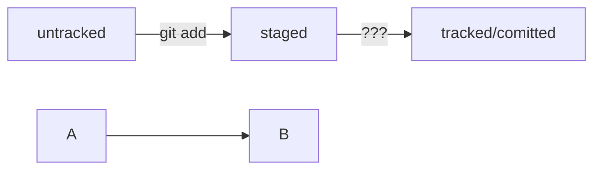

## Начальная инструкция
Инициализировать репозиторий можно с помощью команды 
```bash
git init
```
Проверить статус, или состояние, репозитория поможет команда 
```
git status
```
Если вы ошиблись и случайно инициализировали не ту папку, можно «разгитить» её — удалить скрытую подпапку .git.

Связанность репозитариев  
```git remote add```
Проверка связи
```$ git remote -v```

###Работа с удаленным гитом
Команда 
```git add```
позволяет подготовить файл к сохранению.
Команда 
```git add --all```
подготовит к сохранению сразу все файлы.
С помощью 
```git add .```
можно добавить в репозиторий текущую папку со всеми файлами.

###Затем комитим в гит с подписью
Когда вы делаете коммит, Git обновляет refs/heads/master — записывает в него хеш последнего коммита. Получается, что HEAD тоже обновляется, так как ссылается на refs/heads/master
```git commit -m "Добавление README.md"```

### Затем пушим в гит В первый раз эту команду нужно вызвать с флагом -u и параметрами origin (имя удалённого репозитория) и main или master (название текущей ветки). Флаг -u свяжет локальную ветку с одноимённой удалённой
```git push -u origin main```

Вывод: Сначала add затем commit затем push 


###Вывод команды git log
```git log --oneline```
умещается максимум 72 первых символа сообщения, поэтому многие правила включают пункт: «Сообщение не должно быть длиннее 72 символов».


HEAD -- это голова.
Коммит -- это всему голова.
Статусы файлов:
<тут пустая строка!>



<и тут пустая строка!>